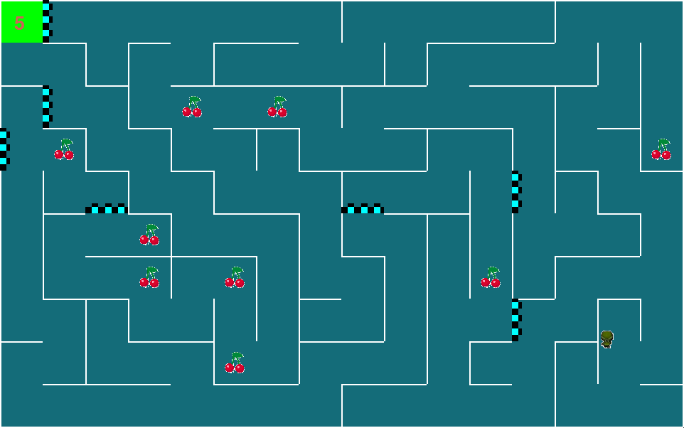


# Игра-лабиринт CheerryMaze
Герой оказывается в случайно сгенерированном* лабиринте, где разбросаны вишенки и есть шипы. Задача игрока – выбраться из лабиринта.

## Вишенки:
Вишенки – это жизни игрока. Они разложены по лабиринту случайным образом. Если игрок съест одну вишенку, то у него прибавляется жизнь. В начале игры у игрока есть 5 жизней.
## Шипы
Шипы - это опасность для жизни игрока. Если не сумеете вовремя пробежать, у вас отнимется жизнь!
## База данных:
1. Таблица Person
    - ID
    - name
    - password
2. Таблица Statistic
    - user_id - id пользователя
    - cherries - сколько вишенок игрок съел за всё время игры
    - lives - сколько жизней у него осталось в последней игре
    - time - сколько времени игрок суммарно провел в игре
    - max_cherry - максимальное количество набранных вишенок в одной партии
## Правило написания названий функции:
Сначала глагол – потом название: если функция отвечает за ходьбу, называем do_walk. Проверить, что клетка пустая, - check_cell_empty. 
## На главной странице:
- Кнопка «Играть»
- Кнопка Выхода
- Возможность выбора персонажа (выбор не сохраняется без аккаунта)
- Меню
  - Профиль с возможностью регистрации для сохранения данных
  - Статистика, если вы зарегистрированы
  - Инструкция пользователю
---
## Авторы
* [Дуброва Анфиса](https://github.com/Anfisa2209)
* [Проскура Андрей](https://github.com/Andrew-Proskura)
* [Соболь Анжелика](https://github.com/AnzhelicaS)
## Установка
1. Создайте новое виртуальное окружение
2. Установите все зависимости `pip install -r requirements.txt`
## Запуск
Для запуска введите в терминал: `python main.py`

*[Генерация лабиринтов взята с Github и доработана](https://gist.github.com/0x3b6/82c92f8422752d47d793b073be145a4c)